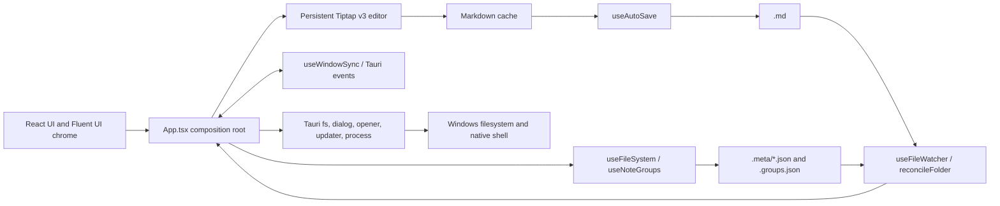

# Noten Source Layout and Architecture

This document is the high-level map of the current repository. Keep it concise: detailed implementation invariants belong in [`AGENTS.md`](../AGENTS.md), while user-facing behavior belongs in [`README.md`](../README.md).

## Repository layout

| Path | Purpose |
| --- | --- |
| `src/` | React and TypeScript application code. |
| `src/components/` | Fluent UI app chrome and the persistent Tiptap editor component. |
| `src/hooks/` | Application orchestration for settings, loading, autosave, file operations, file watching, cross-window sync, and notes-directory migration. |
| `src/extensions/` | Tiptap extensions and NodeViews for Markdown, images, Mermaid, wiki links, anchor links (`AnchorLink.ts`), search decorations, slash commands, and editor behavior. |
| `src/utils/` | Persistence, reconciliation, conflict backup, migration, image assets, export, error logging, outline/heading-slug helpers (`outline.ts`, `headingSlug.ts`), and other shared utilities. Tests are colocated with the modules they cover. |
| `src/styles/` | Shared editor, theme, interaction, wiki-link, slash-command, and Mermaid styles. |
| `src/i18n.ts` | Korean and English user-visible strings. |
| `src-tauri/` | Tauri v2 application crate, configuration, capability allowlist, icons, NSIS hooks, and native commands. |
| `bootstrapper/` | Windows installer bootstrapper that embeds and launches the NSIS payload. |
| `maintenance-helper/` | Windows uninstall/maintenance helper bundled with the app. |
| `noten-splash-ui/` | Shared native Windows splash/progress UI used by the helper executables. |
| `scripts/` | Helper preparation, local release smoke build, and version synchronization scripts. |
| `public/` | Static app icon and bundled editor fonts. |
| `docs/` | Maintained project documentation and dated review reports. |
| `.github/workflows/` | Windows CI and tag-triggered signed release automation. |
| Root config files | npm/Vite/TypeScript/Vitest/ESLint configuration and the Rust helper workspace. |

`node_modules/`, `dist/`, `target/`, `src-tauri/target/`, generated Tauri schemas, copied helper resources, and embedded installer payloads are build products rather than source architecture.

## Runtime architecture

`src/main.tsx` initializes crash logging and mounts `App`. `src/App.tsx` is the composition root: it owns window-level UI state, connects the hooks below, and passes commands and state into the sidebar, editor, toolbar, status bar, search, and settings components.



### Editor and Markdown

- Markdown text is the serialization format and source of truth on disk.
- One persistent Tiptap v3 instance provides the WYSIWYM editing surface. It becomes editable after a document is ready.
- `useMarkdownState` caches serialization. Tiptap updates mark the cache stale; autosave snapshots refresh it with `editor.getMarkdown()`.
- `TiptapEditorHandle.openDocument({ noteId, filePath, markdown, reason })` is the normal load/switch path. It restores a matching per-document ProseMirror state or parses Markdown into a new state, retaining at most 20 document sessions for selection and undo history. `setContent()` is the fallback wrapper. Document-switching code primes the Markdown cache separately.
- Tiptap-specific behavior stays in `src/extensions/`; visual app chrome stays in `src/components/`.

### State and persistence

The active notes directory contains shared, syncable data:

```text
<notes-directory>/
  <noteId>.md
  .meta/<noteId>.json
  .groups.json
  .assets/<noteId>/<hash>.<ext>
  .trash/<noteId>.md
  .conflicts/...
```

- Note bodies are autosaved with a 1-second debounce using fail-closed atomic writes serialized per note.
- Per-note metadata carries title, timestamps, trash state, group membership clocks, pinned state, and color. Shared group definitions live in `.groups.json`.
- `useNotesLoader` loads and persists decomposed note state; `useFileSystem` implements note lifecycle operations; `useAutoSave` owns body snapshots and save draining.
- The app-data directory holds per-machine state such as `settings.json`, `ui-state.json`, `manifest-cache.json`, `machine-id`, the migration journal, and `crash.log`. Sidebar open state and width are kept in localStorage.
- A legacy monolithic `manifest.json` is decomposed when encountered during load or folder migration and retired as `manifest.legacy.json`.

### Folder sync, windows, and migration

- `useFileWatcher` and `reconcileFolder` merge changes arriving through local or cloud-synced folders. Remote body conflicts use last-write-wins and preserve the displaced body under `.conflicts/`.
- `useWindowSync` broadcasts note, group, pin, color, and trash changes between Tauri windows. Remote updates leave dirty local documents untouched. Remote deletion always wins: autosave for that note is cancelled, a dirty local body is folded into the matching trash body when possible, and only a divergent or unwritable trash version falls back to `.conflicts/`; preservation failure is logged but never resurrects the deleted note.
- Notes-directory changes are coordinated by `useMigrationSync`: peer windows drain saves and block old-directory writes before the copy. Timeouts retain the source for deferred cleanup, and heartbeat/watchdog events release peers if the migrating window disappears.
- Migration ordering is copy, persist `notesDirectory`, then clear or defer cleanup of the source so a crash does not leave a partial-only authoritative directory.

### Native and release layers

`src-tauri/src/lib.rs` registers the filesystem, dialog, opener, updater, and process plugins plus native commands for PDF printing through Edge, debug-only DevTools toggling, Windows app-theme lookup, and the Windows emoji picker. At startup it also copies the bundled maintenance helper to local app data and repairs its uninstall registry commands. The capability file limits filesystem access to app data, local app data, and the user's home directory; no HTTP client plugin is enabled.

The root Cargo workspace builds `bootstrapper`, `maintenance-helper`, and `noten-splash-ui`; the Tauri crate is built separately under `src-tauri/`. `npm run tauri:dev` prepares the maintenance helper before starting Tauri. Tag-triggered GitHub Actions build Tauri-signed updater artifacts and the bootstrapper, Authenticode-sign the bootstrapper when certificate secrets are available, and leave the GitHub release as a draft for manual publication.

## Change checklist

When a change adds, removes, or moves a meaningful source path, or changes any boundary or data flow described above:

1. Update this document in the same change.
2. Update `AGENTS.md` when an implementation invariant or contributor rule changed.
3. Update `README.md` when users, installers, prerequisites, or public features are affected.
4. Keep generated/build output out of the source layout and run `npm run check` before handing off the change.
