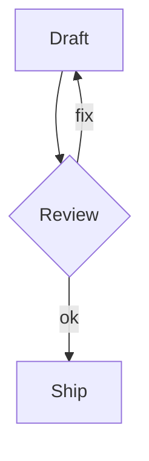

# Kitchen Sink Note

This note mixes **strong**, _emphasis_, ~~strike~~, `inline code`, escaped markers \*literal asterisk\*, and a [safe link](https://example.com/docs?q=noten#roundtrip).

> A block quote with Korean text.
>
> 두 번째 줄은 빈 인용 줄 뒤에 옵니다.

- Plain bullet
  - Nested bullet with `code`
- [ ] Task item
  - [x] Nested completed task
- [x] Done item with [[Project Alpha]]

1. Ordered one
2. Ordered two with **bold**
   1. Nested ordered item

| Feature | Status | Notes |
| --- | --- | --- |
| Tables | yes | empty cell follows |
| Empty |  | should stay empty |
| Inline | `code` | [link](https://example.com) |



```ts
const value = `template ${name}`;
console.log(value);
```


Line with hard break.  
Next visual line.

한국어 English 日本語 中文 العربية emoji 😀.
